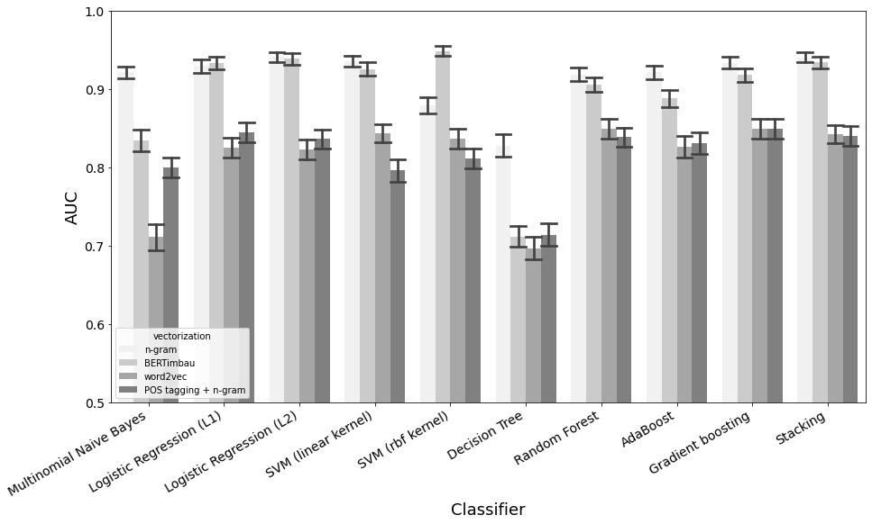

 # Binary autorship attribution on Reddit with comments in Portuguese

Internet interaction environments such as social networks transfer large-scale textual data that implicitly carry the writing styles of each network user. Given the constant and intense flow of information through information systems of this type, it is necessary to develop techniques that can distinguish a text between two candidate authors for reasons of, for example, avoiding the return of users banned from the platform. This repository addressed and evaluated different ways of performing authorship attribution through natural language processing and machine learning, based on comments in Portuguese extracted from the social network Reddit.

Authorship attribution is the task of recognizing the author who wrote a text through his writing style, and to perform attribution in an automated way, natural language processing and machine learning techniques are used. The application of such methods is varied, and so is the way of approaching problems.

This repository contains the codes for the problem of binary authorship attribution, being part of the final paper that [I (Vinicius Alves Matias)](http://lattes.cnpq.br/4897472300687223) carried out to obtain a bachelor's degree in Information Systems, supervised by Dr. [Luciano Antonio Digiampietri](http://lattes.cnpq.br/1689147340536405).
